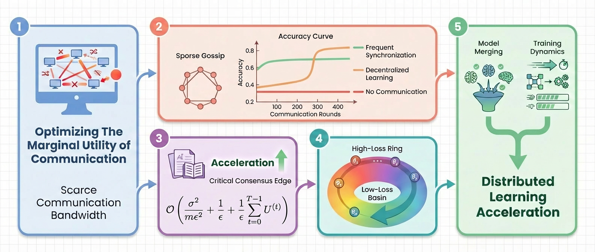

# [ICLR 2026 Oral] On the Surprising Effectiveness of a Single Global Merging in Decentralized Learning

<p align="center">
  <strong>Official code for the paper, with a lightweight simulator for gossip-based decentralized learning.</strong>
</p>

<p align="center">
  Tongtian Zhu<sup>*</sup>, Tianyu Zhang<sup>*</sup>, Mingze Wang, Zhanpeng Zhou<sup>†</sup>, Can Wang
</p>

<p align="center">
  <sub><sup>*</sup>Equal contribution. <sup>†</sup>Corresponding author.</sub>
</p>

<p align="center">
  <a href="#overview"></a>
  <a href="https://openreview.net/forum?id=zrFnwRHuQo"></a>
  <a href="resources/papers/iclr-2026-single-global-merging-decentralized-learning.pdf"></a>
  <a href="https://paper-list.notion.site/ICLR-26-Oral-The-Grokking-Moment-in-Decentralized-Learning-On-The-Surprising-Effectiveness-of-A--2f43218102c0805d99d6e56d2934fac4?pvs=74"></a>
  <a href="LICENSE"></a>
  <a href="CITATION.cff"></a>
  <a href="#quick-start"></a>
  <a href="docs/reproducibility.md"></a>
  <a href="docs/concepts.md"></a>
  <a href="docs/implementation_details.md"></a>
  <a href="docs/results_mapping.md"></a>
</p>

<p align="center">
  <a href="https://openreview.net/forum?id=zrFnwRHuQo">Paper</a> | <a href="resources/papers/iclr-2026-single-global-merging-decentralized-learning.pdf">PDF</a> | <a href="https://paper-list.notion.site/ICLR-26-Oral-The-Grokking-Moment-in-Decentralized-Learning-On-The-Surprising-Effectiveness-of-A--2f43218102c0805d99d6e56d2934fac4?pvs=74">Blog</a>
</p>

<p align="center">
  
</p>
<p align="center">
  <sub>Figure 1. Research roadmap of this paper.</sub>
</p>

This repository is the official code for our ICLR 2026 Oral paper on single global merging in decentralized learning. The paper asks a simple but underexplored question: <mark>*when communication is expensive, when should that budget be spent*</mark>? The central empirical finding is counterintuitive. Under strong heterogeneity and severe communication constraints, decentralized models can train for most of the run with sparse communication and still benefit dramatically from a *single final global merge*.

The same codebase also serves as <mark>*a lightweight simulator for gossip-based decentralized learning on limited hardware*</mark>. Multiple logical nodes can be hosted on each GPU, local updates are carried out independently, and the node-level gossip operator is then applied across the full simulated system. This makes it practical to study many-node decentralized behavior, temporal communication allocation, and mergeability phenomena without requiring one GPU per logical node.

## TL;DR

- Frequent communication is not the only useful strategy; late communication can be surprisingly valuable.
- Under heterogeneous data, local-model accuracy can stay modest while the counterfactual merged-model accuracy remains high, revealing hidden *"mergeability"*.
- The repository lowers the barrier to decentralized learning research by making few-GPU, many-node experiments practical within a shared multi-GPU workflow.

<p align="center">
  
</p>
<p align="center">
  <sub>Figure 2. Visual summary of the paper's intuition: local models may look weak during long sparse-communication phases, yet a late global merge can reveal a much stronger shared solution.</sub>
</p>

## Highlights

- Official codebase for the paper and its main experimental workflow.
- A compact simulator for many-node decentralized-learning studies on limited hardware.
- Config-driven experimentation over topology, non-IID data, local training frequency, and post-merge rounds.
- A shared training backbone that serves both paper reproduction and simulator-style experimentation.

## Overview

This repository is designed around one shared execution base and two complementary use cases:

- **Paper reproduction**: reproduce, inspect, and adapt the experimental workflow behind the paper.
- **Simulator usage**: treat the repository as a lightweight platform for studying gossip-based decentralized-learning dynamics.

Concretely, the current codebase supports the following:

- Simulate many logical decentralized-learning nodes on a small number of GPUs.
- Vary node count, GPU count, local steps, topology, non-IID severity, and post-merge rounds.
- Support topology schedules and topology switching during training or post-merge.
- Reproduce paper-oriented runs while remaining usable as a small research simulator.

If you are visiting this repository with different goals, start here:

- Paper Track: see the reproducibility workflow in [docs/reproducibility.md](docs/reproducibility.md).
- Figure-by-figure and appendix-style experiment mapping: see [docs/results_mapping.md](docs/results_mapping.md).
- Simulator Track: see the conceptual model and terminology in [docs/concepts.md](docs/concepts.md).
- Implementation semantics: see [docs/implementation_details.md](docs/implementation_details.md) for what is actually merged, which states should be re-estimated, and how to interpret the main mergeability-related metrics.

In short, [docs/reproducibility.md](docs/reproducibility.md) explains how to run experiments reliably, while [docs/results_mapping.md](docs/results_mapping.md) explains which preset or override recipe is closest to a target paper result.

[docs/implementation_details.md](docs/implementation_details.md) explains the simulator's current merging semantics in implementation terms, including the practical distinction between learnable floating-point parameters, BatchNorm statistics, discrete counters, and resume-training state.

In particular, the current implementation distinguishes between training-time communication and final merged-model construction: floating BatchNorm statistics can still propagate during decentralized training, while the final merged model averages only learnable parameters directly and then refreshes BatchNorm statistics through a short calibration pass.

If the immediate goal is to match a specific paper phenomenon or appendix-style ablation, [docs/results_mapping.md](docs/results_mapping.md) is the shortest path from result to preset and override recipe.

## What This Repo Is

- Official code for the paper and its main experimental workflow.
- A reusable simulator for gossip-based decentralized optimization under limited GPU resources.
- A config-driven research package built around [main_multi_GPU.py](main_multi_GPU.py) and [scripts/run_with_config.py](scripts/run_with_config.py).

## What This Repo Is Not

- Not a production multi-node distributed training runtime.
- Not a benchmark of physical network communication costs or systems throughput.
- Not an API-first framework with a stable public Python interface.

## Quick Start

If you only want the shortest path to a runnable setup, use the commands below. If you want the paper-facing workflow or the simulator-facing workflow in more detail, jump to the Paper Track or Simulator Track sections after setup.

Install dependencies and set up the environment:

```bash
bash scripts/bootstrap_env.sh
cp .env.example .env
```

Optional credential setup:

```bash
bash scripts/login_wandb.sh
bash scripts/login_hf.sh
```

Preflight validation:

```bash
bash scripts/preflight.sh
```

Smoke test via config:

```bash
python3 scripts/run_with_config.py --config configs/examples/smoke_test_1gpu_1000steps.yaml
```

Paper-oriented launcher:

```bash
bash scripts/run_main_experiment.sh
```

Minimal fixed launcher:

```bash
bash scripts/run_default.sh
```

Resource monitor for CPU memory, GPU memory, and GPU utilization:

```bash
bash scripts/gpu_monitor.sh
```

This is useful when simulating many logical nodes on a small number of GPUs, where memory pressure can become substantial even in seemingly modest runs.

## Shared Installation, Two Entry Paths

The repository has one shared execution base, but it is documented through two distinct entry paths so that paper readers and simulator users do not have to parse the repository in the same way.

### Paper Track

Use this path if your primary goal is to reproduce, validate, or adapt the experiments behind the paper.

- Start from [docs/reproducibility.md](docs/reproducibility.md).
- Use [configs/paper/run_main_experiment.yaml](configs/paper/run_main_experiment.yaml) and [configs/paper/default_multi_gpu.yaml](configs/paper/default_multi_gpu.yaml) as paper-oriented presets.
- Paper-facing runs should use `data_sampling_mode=resample`: each node keeps a fixed class distribution, but concrete sample indices are redrawn when the training dataloader iterator is recreated.
- Treat [configs/examples/smoke_test_1gpu_1000steps.yaml](configs/examples/smoke_test_1gpu_1000steps.yaml) as a sanity check, not as a final paper run.

### Simulator Track

Use this path if your primary goal is to explore decentralized-learning dynamics under resource constraints rather than follow a fixed paper preset.

- Start from [docs/concepts.md](docs/concepts.md).
- Use [main_multi_GPU.py](main_multi_GPU.py) directly or launch through [scripts/run_with_config.py](scripts/run_with_config.py).
- Modify node count, GPU count, topology, local steps, non-IID strength, and post-merge behavior through configs or CLI flags.
- Simulator-facing runs should usually use `data_sampling_mode=fixed`: each node receives one weighted subset at startup and keeps training on that same local pool, which better matches the "data on device" assumption.

## Current Workflow Model

At a high level, the simulator currently works as follows:

1. Split the full set of logical nodes across the requested GPUs.
2. Train each node locally for a fixed number of local steps.
3. Synchronize node states.
4. Materialize the gossip update over all logical nodes.
5. Broadcast the updated node parameters back to the GPU workers.

This preserves the node-level optimization logic while allowing a small number of GPUs to emulate a larger decentralized system at the level of learning dynamics.

For implementation-level interpretation of gossip versus global averaging, see [docs/implementation_details.md](docs/implementation_details.md).

## Repository Layout

- [main_multi_GPU.py](main_multi_GPU.py): main training entrypoint; orchestrates worker processes, node assignment, evaluation, and post-merge.
- [core](core): communication, topology generation, logging, and optimizer utilities.
- [datasets](datasets): dataset loaders and data partition logic for node-wise training.
- [models](models): model factory and model definitions.
- [configs](configs): runnable presets organized into [configs/paper](configs/paper) and [configs/examples](configs/examples).
- [scripts](scripts): environment setup, credential helpers, config launchers, and convenience wrappers.
- [docs](docs): short supporting documents for reproducibility and simulator concepts.
- [docs/implementation_details.md](docs/implementation_details.md): implementation-level notes on merging semantics, state handling, and metric interpretation.
- [resources](resources): paper PDF and static figures used in the README and documentation.

## Scripts Directory

The [scripts](scripts) directory is intentionally small and operational. It is best understood as a thin workflow layer around the main training code rather than as a separate subsystem.

- [scripts/bootstrap_env.sh](scripts/bootstrap_env.sh): bootstrap a local Python environment and install dependencies.
- [scripts/setup_env.sh](scripts/setup_env.sh): load environment variables from local env files.
- [scripts/preflight.sh](scripts/preflight.sh): basic checks before a long run.
- [scripts/run_with_config.py](scripts/run_with_config.py): the main config-driven launcher.
- [scripts/run_main_experiment.sh](scripts/run_main_experiment.sh): thin wrapper around the paper-oriented config.
- [scripts/run_smoke_test.sh](scripts/run_smoke_test.sh): quick sanity check entry.
- [scripts/run_default.sh](scripts/run_default.sh): minimal fixed launch path.
- [scripts/gpu_monitor.sh](scripts/gpu_monitor.sh): optional resource monitor during heavy runs.

## Main Controls

The most important simulator controls are:

- `num_nodes`: total number of logical decentralized-learning nodes.
- `num_GPU`: number of GPU worker processes used to host those nodes.
- `k_steps`: local optimization steps between adjacent gossip rounds.
- `gossip_topology`: communication structure, such as `exponential`, `random`, or `exponential+random`.
- `r_start`, `r_end`, and `r_schedule`: control how topology connectivity evolves over training.
- `nonIID`, `alpha`, and `node_datasize`: control data heterogeneity and per-node sample budgets.
- `data_sampling_mode`: chooses whether node data is a fixed local subset or a resampled stream from a fixed class distribution.
- `post_merge_rounds` and `end_topology`: control additional gossip-only rounds after decentralized training.

See [docs/concepts.md](docs/concepts.md) for the semantics behind these knobs.

## Current Config Groups

The config set is now split into two practical groups:

- Paper-oriented presets: [configs/paper/default_multi_gpu.yaml](configs/paper/default_multi_gpu.yaml), [configs/paper/run_main_experiment.yaml](configs/paper/run_main_experiment.yaml)
- Example presets: [configs/examples/smoke_test_1gpu_1000steps.yaml](configs/examples/smoke_test_1gpu_1000steps.yaml), [configs/examples/few_gpu_many_nodes_1gpu_8nodes.yaml](configs/examples/few_gpu_many_nodes_1gpu_8nodes.yaml), [configs/examples/few_gpu_many_nodes_4gpu_32nodes.yaml](configs/examples/few_gpu_many_nodes_4gpu_32nodes.yaml), [configs/examples/heterogeneous_data_alpha005.yaml](configs/examples/heterogeneous_data_alpha005.yaml), [configs/examples/post_merge_demo.yaml](configs/examples/post_merge_demo.yaml)

These examples are meant to demonstrate distinct usage patterns: smoke testing, few-GPU/many-node simulation, stronger heterogeneity, and post-merge behavior.

The data policy is intentional:

- paper presets and figure-oriented paper presets use `data_sampling_mode=resample`
- simulator presets use `data_sampling_mode=fixed`
- when a simulator preset is reused as a paper-style ablation, switch it with `--set args.data_sampling_mode=resample`

## Representative Example Presets

- [configs/examples/few_gpu_many_nodes_1gpu_8nodes.yaml](configs/examples/few_gpu_many_nodes_1gpu_8nodes.yaml): the smallest clear example of one GPU hosting multiple logical nodes.
- [configs/examples/few_gpu_many_nodes_4gpu_32nodes.yaml](configs/examples/few_gpu_many_nodes_4gpu_32nodes.yaml): a more realistic constrained-resource simulation where a small GPU pool emulates a much larger decentralized system.
- [configs/examples/heterogeneous_data_alpha005.yaml](configs/examples/heterogeneous_data_alpha005.yaml): emphasizes stronger non-IID heterogeneity under the simulator-style fixed-subset regime; add `--set args.data_sampling_mode=resample` when using it as a paper-style robustness check.
- [configs/examples/post_merge_demo.yaml](configs/examples/post_merge_demo.yaml): explicitly demonstrates extra gossip-only rounds after training and an alternate end topology.
- [configs/examples/figure1_single_merge_resnet18.yaml](configs/examples/figure1_single_merge_resnet18.yaml): a paper-facing figure preset for the late single-merge phenomenon using the `truncate` schedule and `data_sampling_mode=resample`.
- [configs/examples/figure2_dense_window_resnet18.yaml](configs/examples/figure2_dense_window_resnet18.yaml): a paper-facing figure preset for a temporary late dense-communication window using the `truncate_v2` schedule and `data_sampling_mode=resample`.
- [configs/examples/topology_exponential_random.yaml](configs/examples/topology_exponential_random.yaml): shows how `base+random` topologies constrain random neighbor sampling through a structured base graph.

## Reproducibility Notes

- Main experiments can consume substantial memory; monitor GPU pressure when scaling node count.
- AMP defaults to `bf16`; if switched to `fp16`, training uses `GradScaler` automatically.
- `r_start` and `r_end` are interpreted as extra neighbors, excluding self.
- `end_topology` is used only as an optional topology override during post-merge rounds.
- `data_sampling_mode=fixed` means one weighted subset is drawn once per node; `data_sampling_mode=resample` means the node's class distribution is fixed but concrete sample indices are redrawn over time.
- For TinyImageNet runs with small images (for example `image_size=64`), the paper-facing default ResNet is `model_name=resnet18_cifar_stem`.
- If you want a ResNet-18 closer to official torchvision/ImageNet pretrained stem semantics, use `model_name=resnet18_imagenet_stem`.

For a compact reproduction checklist, see [docs/reproducibility.md](docs/reproducibility.md).

## Contact

Questions, comments, or broader discussion about decentralized learning are welcome via email: Tongtian Zhu, [raiden@zju.edu.cn](mailto:raiden@zju.edu.cn).

## Citation

```bibtex
@inproceedings{
zhu2026on,
title={On The Surprising Effectiveness of a Single Global Merging in Decentralized Learning},
author={Tongtian Zhu and Tianyu Zhang and Mingze Wang and Zhanpeng Zhou and Can Wang},
booktitle={The Fourteenth International Conference on Learning Representations},
year={2026},
url={https://openreview.net/forum?id=zrFnwRHuQo}
}
```

## License

This repository is released under the MIT License. See [LICENSE](LICENSE) for details.